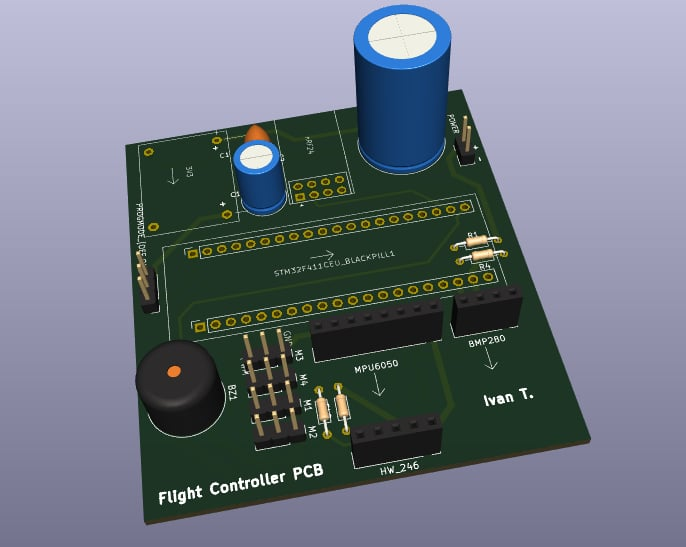
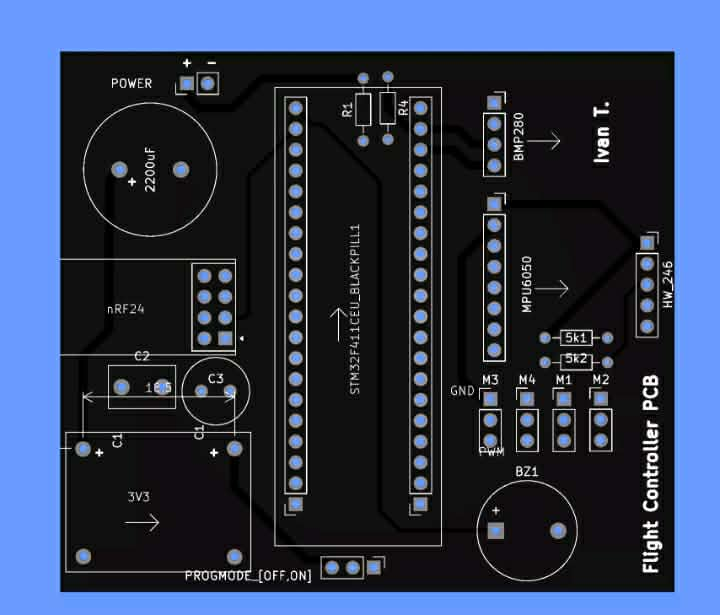
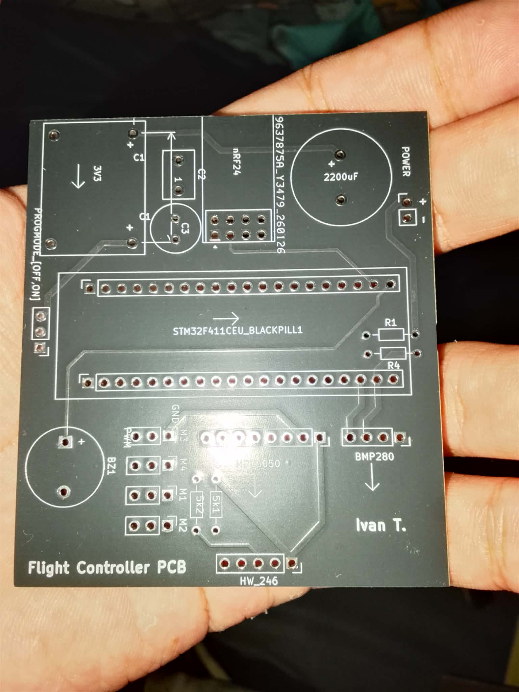
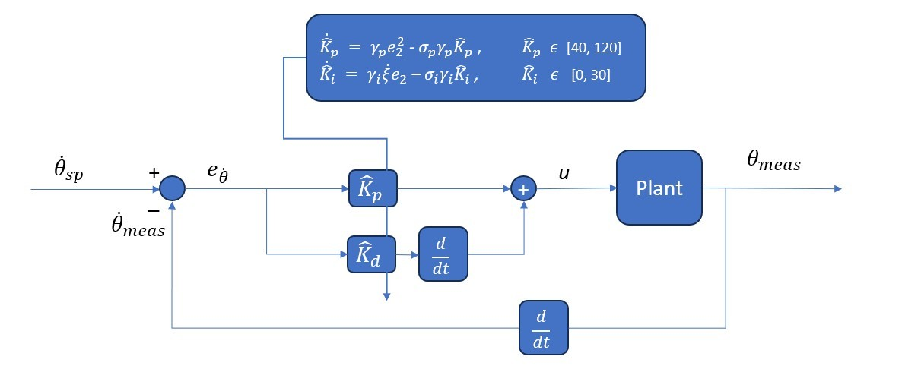

# STM32 Drone Flight Controller

> **Flight-Validated on 450mm Quadrotor**

A real-time flight controller for STM32F4-based drones built with FreeRTOS and custom drivers.

---

## 📸 Hardware

| | |
|---|---|
| **450mm Quadrotor** | **Flight Controller (KiCad)** |
|  |  |
| **PCB - Black** | **PCB - Real** |
|  |  |

**V2.0 - 4-Layer Design**


---

## ✨ Features

- 🔄 Modular FreeRTOS-based architecture
- 🎯 ATTi (Attitude) Mode
- 🧠 Madgwick Sensor Fusion (9DoF)
- 📊 Vertical Velocity 3-State Kalman Filter
- ⚡ Vertical Velocity PI Controller
- 📡 nRF24L01 Radio
- 🛡️ Watchdog-protected system with failsafe reboot
- 🎮 Clean, low-latency motor PWM generation
- 📦 Custom lightweight libraries

---

## System Flowchart


---

## 🛠️ Hardware

- **MCU:** STM32F411CEU
- **IMU:** MPU6050
- **Magnetometer:** QMC5883P (Optional)
- **Barometer:** BMP280
- **Radio:** nRF24L01+ PA/LNA
- **Motors:** 930KV Brushless
- **ESCs:** 30A
- **DC-DC Buck:** 1.2A @ 3.3V

---

## 🎮 Control Architecture

### Input Limits

- **Roll:** [-20, 20] degrees
- **Pitch:** [-20, 20] degrees
- **Yaw rate:** [-360, 360] deg/sec
- **Vertical velocity:** [-0.8, 1.0] m/s

### Cascaded Adaptive P-PID (Roll & Pitch)

**Outer Loop (Angle)**
- Controller: P
- Frequency: 100 Hz
- Output limit: [-π, π] rad/s


**Inner Loop (Rate)**
- Controller: PID
- Frequency: 500 Hz
- Output limit: [-150, 150] PWM ticks



### Yaw PI Controller

- Controller: PI
- Frequency: 500 Hz
- Output limit: [-100, 100] PWM ticks

### Vertical Velocity

- Controller: PI
- Frequency: 100 Hz
- Output limit: [0, 750] PWM ticks

### ESC Calibration

- PWM min: 1000 µs
- PWM max: 2000 µs

### Low-Pass Filters

- PT1: EMA (Exponential Moving Average)
- PT2: Cascaded EMA

---

## ⏱️ Timing Configuration

- **Sensor read:** 1 kHz
- **Attitude PID + Madgwick:** 500 Hz
- **Vertical Velocity PI:** 100 Hz
- **Radio:** Interrupt-driven
- **Watchdog:** 1 Hz

---

## 📡 Communication

- **Max payload:** 32 bytes per transmission
- **Direction:** Bidirectional (2-way)
- **Protocol:** nRF24L01

---

## 📁 Repository Structure

```
.
├── .vscode/           # VS Code workspace settings
├── images/            # README images (drone, PCB, diagrams)
├── include/           # Header files (default)
├── lib/               # Custom libraries (sensor drivers, control, etc.)
├── src/               # main.cpp and core application code
├── test/              # Unit tests (default)
├── .gitignore
├── README.md
└── platformio.ini     # PlatformIO build configuration
```

## Connect

- **Email:** ivantuanadatu204@gmail.com
- **LinkedIn:** [linkedin.com/in/ayob-ii-tuanadatu](www.linkedin.com/in/ayob-ii-tuanadatu)

## 📄 License

MIT